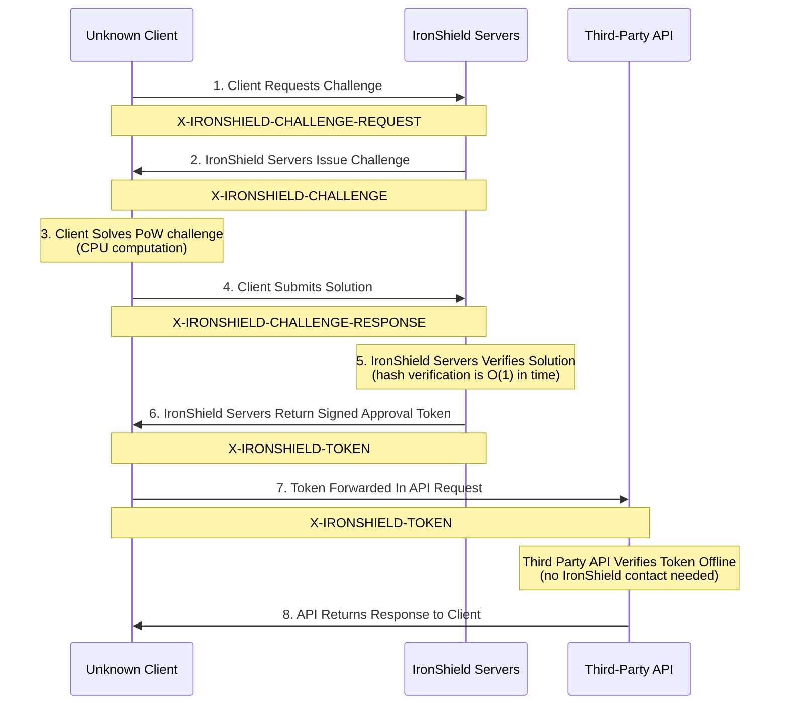

# API

IronShield API provides **distributed Proof of Work verification** that allows third-party services, applications, and APIs to verify clients have solved valid computational challenges to prove they aren't malicious without requiring direct communication with IronShield servers. This creates a **zero-trust, sandboxed verification system** that is extremely difficult to exploit and can be utilized in threat models that are more extreme, such as servers that only allow inbound network traffic.

## Overview

The IronShield API verification system operates through a **cryptographically-secured token exchange process** that enables any third-party service to independently verify that a client has completed legitimate computational work (Proof of Work). This system is designed to be completely **offline-verifiable**, meaning verification can happen in sandboxed environments without any outbound network traffic to IronShield. For more detailed information on the PoW system, please see the [Core Platform Documentation](/docs/platforms/core).

### Key Features
- **🌐 Universal Compatibility** - Works with any HTTP-based API or service
- **📦 Simple Integration** - Just verify HTTP headers - no complex SDKs required
- **⚡ Zero-Latency Verification** - No need to contact IronShield servers for token validation
- **🛡️ Sandboxed Security** - Verification works in completely isolated environments
- **🔐 Offline Cryptographic Verification** - ECDSA signatures allow offline verification and authentication of PoW tokens


## How It Works: Complete Verification Flow
The IronShield verification process involves **eight distinct steps** that create a secure, verifiable chain of trust without requiring ongoing communication between your API and IronShield servers. Included in this diagram are also the custom X-IRONSHIELD HTTP headers parties use to communicate with each other via this protocol.



:::tip Why This Matters
This architecture allows any third party to verify legitimate users **without any dependency on IronShield's infrastructure**. Even if IronShield servers are completely unreachable, your API can still verify tokens and serve legitimate traffic.
:::

Now let's walk through each step of the verification process in detail, including the exact HTTP headers used and what happens at each stage.

### Step 1: Client Requests Challenge

When an unknown client wants to access a third-party application, service, or API protected by IronShield, they first need to obtain a computational challenge. 
The client sends a HTTP request to IronShield servers with a specific Base64URL'd header.

:::info Base64URL Encoding
All IronShield headers use **Base64URL encoding** (not standard Base64) to avoid browser-unsafe characters like `+`, `/`, and `=`. 
This ensures headers work seamlessly across all HTTP implementations and can be easily represented, copied, and modified since they are just one long blob of text. Fundamentally, all headers are just concatenated JSON blobs.
:::

**Example HTTP Header:** `X-IRONSHIELD-REQUEST`

```http
X-IRONSHIELD-REQUEST: eyJ0eXBlIjoiY2hhbGxlbmdlX3JlcXVlc3QiLCJ0YXJnZXRfYXBpIjoiYXBpLmV4YW1wbGUuY29tIiwidGltZXN0YW1wIjoxNzA5NTU5NjAwfQ
```

**Example Header Content (Base64URL decoded into JSON):**
```json
IronShieldRequest {
  endpoint: "api.example.com",
  timestamp: 1709559600,
}
```

### Step 2: IronShield Issues Challenge

IronShield servers respond with a computational challenge that the client must solve. This challenge includes all the parameters needed for the Proof of Work computation.

**Example HTTP Header:** `X-IRONSHIELD-CHALLENGE`

```http
X-IRONSHIELD-CHALLENGE: eyJjaGFsbGVuZ2VfaWQiOiJjaGFsXzE3MDk1NTk2MDBfYWJjZGVmIiwiZGlmZmljdWx0e
```

**Example Decoded Header Content:**
```json
IronShieldChallenge {
  random_nonce: "c08abf60044461685da78f81bbc8b1bb",
  created_time: 1750726438000,
  expiration_time: 1750726468000,
  website_id: "api.example.com",
  challenge_param: "[0, 64, 0, 0, 0, 0, 0, 0, 0, 0, 0, 0, 0, 0, 0, 0, 0, 0, 0, 0, 0, 0, 0, 0, 0, 0, 0, 0, 0, 0, 0, 0]",
  recommended_attempts: 400000000,
  public_key: "[71, 15, 1, 1, 7, 64, 28, 152, 78, 88, 44, 175, 57, 103, 175, 203, 107, 65, 139, 247, 54, 246, 169, 209, 116, 166, 25, 71, 174, 193, 66, 191]",
  challenge_signature: "[53, 245, 22, 118, 172, 48, 137, 177, 241, 87, 101, 189, 242, 199, 123, 118, 136, 215, 213, 95, 160, 220, 252, 252, 210, 70, 192, 212, 245, 91, 164, 156, 124, 169, 26, 172, 38, 42, 104, 51, 140, 69, 39, 125, 114, 62, 146, 96, 202, 147, 184, 141, 182, 5, 218, 253, 111, 0, 213, 212, 197, 22, 114, 4]"
}
```

**What Each Field Means:**

- **`random_nonce`**:         The SHA-256 hash of a random number (hex string)
- **`created_time`**:         Unix milli timestamp for the challenge.
- **`expiration_time`**:      Unix milli timestamp for the challenge expiration time.
- **`challenge_param`**:      Target threshold - hash must be less than this value.
- **`recommended_attempts`**: Expected number of attempts for user guidance (2x difficulty).
- **`website_id`**:           The identifier of the website.
- **`public_key`**:           Ed25519 public key for signature verification.
- **`challenge_signature`**:  Ed25519 signature over the challenge data.

### Step 3: Client Solves Challenge Locally

This is where the actual **Proof of Work** computation happens. The client takes the challenge parameters and performs a brute-force search to find a nonce value that, when combined with the random nonce in the challenge data, produces a hash that is less than the target thereshold. For more detailed information on the proof-of-work system, please see the [Core Platform Documentation](/docs/platforms/core).

**What the Client Must Do:**

1. **Extract challenge parameters** from the received challenge
2. **Iterate through nonce values** in the specified range
3. **Compute the hash** for each attempt using the formula: `SHA256(guessed_nonce + random_nonce)`
4. **Check the hash** to see if it is less than the `challenge_param` 
5. **Stop when solution is found**

:::warning Computational Cost
The difficulty directly impacts computation time. A difficulty of 1,000,000 (meaning a valid solution can be found within 1,000,000 hashing attempts) might take a few seconds, while a difficulty of 200,000,000 could take several minutes. This creates the economic barrier against automated attacks.
:::

### Step 4: Client Submits Solution to IronShield

Once the client has found a valid nonce that produces the target hash, they submit their solution back to IronShield servers for verification and token generation.

**Example HTTP Header:** `X-IRONSHIELD-CHALLENGE-RESPONSE`

```http
X-IRONSHIELD-CHALLENGE-RESPONSE: eyJjaGFsbGVuZ2VfaWQiOiJjaGFsXzE3MDk1NTk2MDBfYWJjZGVmIiwiZGlmZmljdWx0e
```

**Decoded Challenge Response Content:**
```json
IronShieldChallengeResponse {
  solved_challenge: IronShieldChallenge {
    random_nonce: "c08abf60044461685da78f81bbc8b1bb",
    created_time: 1750726438000,
    expiration_time: 1750726468000,
    website_id: "api.example.com",
    challenge_param: "[0, 64, 0, 0, 0, 0, 0, 0, 0, 0, 0, 0, 0, 0, 0, 0, 0, 0, 0, 0, 0, 0, 0, 0, 0, 0, 0, 0, 0, 0, 0, 0]",
    recommended_attempts: 400000000,
    public_key: "[71, 15, 1, 1, 7, 64, 28, 152, 78, 88, 44, 175, 57, 103, 175, 203, 107, 65, 139, 247, 54, 246, 169, 209, 116, 166, 25, 71, 174, 193, 66, 191]",
    challenge_signature: "[53, 245, 22, 118, 172, 48, 137, 177, 241, 87, 101, 189, 242, 199, 123, 118, 136, 215, 213, 95, 160, 220, 252, 252, 210, 70, 192, 212, 245, 91, 164, 156, 124, 169, 26, 172, 38, 42, 104, 51, 140, 69, 39, 125, 114, 62, 146, 96, 202, 147, 184, 141, 182, 5, 218, 253, 111, 0, 213, 212, 197, 22, 114, 4]"
  },
  solution: 78612341
}
```

**What Each Field Means:**

- **`solved_challenge`**: The now solved challenge issued to client
- **`solution`**:         Valid solution nonce

:::tip Why Server Verification is Near-Instant
Server verification only requires **one hash computation** to check the client's work, making it extremely fast even under high load. The computationally expensive work of finding a valid nonce was done by the client.
:::

### Step 5: IronShield Issues Approval Token

When IronShield verifies that the client's solution is correct, it generates a **cryptographically signed approval token** that serves as proof the client completed valid computational work.

**Example HTTP Header:** `X-IRONSHIELD-TOKEN`

```http
X-IRONSHIELD-TOKEN: eyJjaGFsbGVuZ2VfaWQiOiJjaGFsXzE3MDk1NTk2MDBfYWJjZGVmIiwiZGlmZmljdWx0e
```

**Decoded Token Content:**
```json
IronShieldToken {
  "challenge_signature": "[53, 245, 22, 118, 172, 48, 137, 177, 241, 87, 101, 189, 242, 199, 123, 118, 136, 215, 213, 95, 160, 220, 252, 252, 210, 70, 192, 212, 245, 91, 164, 156, 124, 169, 26, 172, 38, 42, 104, 51, 140, 69, 39, 125, 114, 62, 146, 96, 202, 147, 184, 141, 182, 5, 218, 253, 111, 0, 213, 212, 197, 22, 114, 4]",
  "valid_for": 175072678000,
  "public_key": "[71, 15, 1, 1, 7, 64, 28, 152, 78, 88, 44, 175, 57, 103, 175, 203, 107, 65, 139, 247, 54, 246, 169, 209, 116, 166, 25, 71, 174, 193, 66, 191]",
  "auth_signature": "[97, 70, 170, 21, 199, 121, 67, 32, 236, 222, 82, 62, 43, 209, 151, 191, 158, 231, 122, 96, 241, 168, 37, 99, 10, 250, 111, 79, 157, 29, 14, 133, 230, 49, 80, 85, 68, 45, 81, 71, 143, 206, 194, 129, 61, 95, 110, 103, 207, 77, 0, 234, 140, 143, 54, 136, 92, 149, 89, 105, 237, 171, 10, 0]"
}
```

**What Each Field Means:**

- **`challenge_signature`**: Ed25519 signature over the challenge data
- **`valid_for`**:           The unix milis timestamp of when the token expires
- **`public_key`**:          Ed25519 public key for signature verification.
- **`auth_signature`**:      Ed25519 signature over token data

:::warning Security Notice
The **authentication signature is the critical security component**. It proves that IronShield servers verified valid computational work and issued this specific token. Without access to IronShield's private key, nobody can forge valid `auth_signature`'s.
:::


### Step 6: Third-Party API Verifies Token Offline

After a client receives a token, it can be forwarded to any service, API, or app protected by IronShield to authenticate it is a legitimate request. Any third-party can cryptographically verify that clients have completed valid Proof of Work **without contacting IronShield servers**. This enables complete offline verification in sandboxed environments. For more details on the proof-of-work verification process, please see the [Core Platform Documentation](/docs/platforms/core).


## Why This Design is Secure

- **Cryptographic Proof**: Ed25519 signatures provide mathematical certainty IronShield's servers approved a request
- **Tamper-Evident**: Any modification to token data invalidates the signature
- **Time-Limited**: Tokens have explicit expiration timestamps, preventing malicious parties from caching successful tokens to redeem all at once against a service
- **Replay Protection**: Every token has a unique `challenge_signature`, preventing malcicious parties from reusing tokens
- **Offline Verification**: Anybody can verify the `auth_signature` was generated by the IronShield server's `public_key`