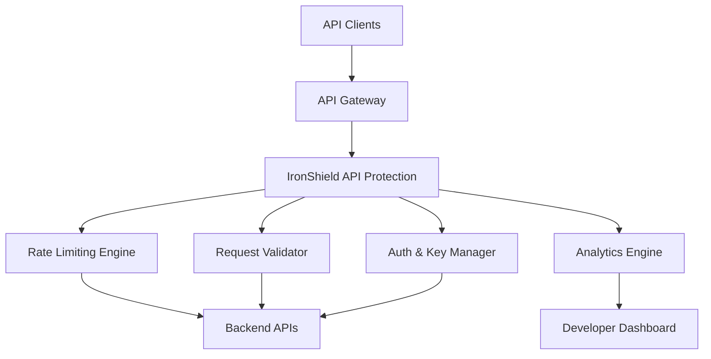

# API 

IronShield API provides **comprehensive API protection** with advanced rate limiting, endpoint-specific security policies, and developer-friendly tools for securing modern API infrastructures.

## Overview

The API platform specializes in protecting RESTful APIs, GraphQL endpoints, and microservices from abuse, attacks, and unauthorized access. It provides granular control over API traffic with intelligent rate limiting, request validation, and real-time threat detection specifically designed for API workloads.

### Key Features

- **Intelligent Rate Limiting** - Adaptive rate limiting based on user behavior and API usage patterns
- **Endpoint-Specific Policies** - Custom protection rules for different API endpoints
- **Request/Response Validation** - Schema validation and payload inspection
- **API Key Management** - Secure API key generation, rotation, and monitoring
- **Developer Dashboard** - Real-time API analytics and performance monitoring

## Architecture



## Getting Started

### Prerequisites

- **Minimum Requirements**: 4GB RAM, 2 CPU cores
- **Network Access**: Port 7070 for API gateway, 7071 for management
- **Database**: Redis for rate limiting, PostgreSQL for analytics
- **API Gateway**: Compatible with Kong, Nginx, AWS API Gateway, etc.

### Quick Deployment

```bash
# Deploy API protection
docker run -d \
  --name ironshield-api \
  -p 7070:7070 -p 7071:7071 \
  -e API_REDIS_HOST=your-redis-host \
  -e API_DB_HOST=your-postgres-host \
  -e API_JWT_SECRET=your-jwt-secret \
  -e API_ADMIN_KEY=your-admin-key \
  ironshield/api:latest
```

## Configuration

### Basic Configuration

Create an `api-config.yml` file:

```yaml
api:
  # Gateway configuration
  gateway:
    host: "0.0.0.0"
    port: 7070
    ssl_enabled: true
    cert_path: "/etc/ssl/certs/api.crt"
    key_path: "/etc/ssl/private/api.key"
    
  # Rate limiting
  rate_limiting:
    default_limit: 1000/hour
    burst_limit: 100
    window_size: 3600
    
  # Authentication
  authentication:
    api_key_required: true
    jwt_enabled: true
    oauth2_enabled: false
```

### Advanced Settings

#### Endpoint-Specific Policies

Configure protection policies per endpoint:

```yaml
endpoint_policies:
  - path: "/api/v1/auth/login"
    methods: ["POST"]
    rate_limit: 10/minute
    validation:
      schema_required: true
      max_payload_size: 1KB
    security:
      require_https: true
      block_suspicious_ips: true
      
  - path: "/api/v1/users/*"
    methods: ["GET", "PUT", "DELETE"]
    rate_limit: 100/minute
    authentication:
      api_key_required: true
      scopes: ["users:read", "users:write"]
      
  - path: "/api/v1/public/*"
    methods: ["GET"]
    rate_limit: 5000/hour
    authentication:
      api_key_required: false
    caching:
      enabled: true
      ttl: 300
```

#### Advanced Rate Limiting

Configure intelligent rate limiting:

```yaml
intelligent_rate_limiting:
  adaptive_limits:
    enabled: true
    base_multiplier: 1.0
    spike_detection: true
    user_behavior_learning: true
    
  limit_tiers:
    free:
      requests_per_hour: 1000
      burst_limit: 50
      concurrent_requests: 10
      
    premium:
      requests_per_hour: 10000
      burst_limit: 200
      concurrent_requests: 50
      
    enterprise:
      requests_per_hour: 100000
      burst_limit: 1000
      concurrent_requests: 200
```

## API Protection Features

### Request Validation

#### Schema Validation

Validate incoming requests against OpenAPI specifications:

```yaml
schema_validation:
  openapi_spec: "/config/api-spec.yml"
  strict_mode: true
  validate_responses: true
  
  custom_validators:
    - name: "email_validator"
      pattern: "^[a-zA-Z0-9._%+-]+@[a-zA-Z0-9.-]+\\.[a-zA-Z]{2,}$"
      
    - name: "phone_validator"
      pattern: "^\\+?[1-9]\\d{1,14}$"
```

#### Payload Protection

Protect against malicious payloads:

```yaml
payload_protection:
  max_request_size: 10MB
  max_json_depth: 10
  max_array_length: 1000
  
  content_filtering:
    sql_injection_detection: true
    xss_detection: true
    command_injection_detection: true
    
  file_upload_protection:
    max_file_size: 50MB
    allowed_extensions: [".jpg", ".png", ".pdf", ".docx"]
    virus_scanning: true
```

### API Key Management

#### Key Generation and Rotation

```bash
# Generate new API key
curl -X POST -H "Authorization: Bearer $ADMIN_KEY" \
  https://api.yourdomain.com:7071/admin/keys/generate \
  -d '{
    "name": "Mobile App v2.0",
    "scopes": ["users:read", "posts:write"],
    "rate_limit_tier": "premium",
    "expires_in": "365d"
  }'

# Rotate existing key
curl -X POST -H "Authorization: Bearer $ADMIN_KEY" \
  https://api.yourdomain.com:7071/admin/keys/{key_id}/rotate

# Revoke compromised key
curl -X DELETE -H "Authorization: Bearer $ADMIN_KEY" \
  https://api.yourdomain.com:7071/admin/keys/{key_id}
```

#### Key Analytics

Monitor API key usage:

```javascript
{
  "key_id": "ak_live_1234567890",
  "key_name": "Mobile App v2.0",
  "usage_stats": {
    "requests_today": 15420,
    "requests_this_month": 487650,
    "rate_limit_hits": 23,
    "error_rate": 0.02
  },
  "top_endpoints": [
    "/api/v1/users/profile",
    "/api/v1/posts/feed",
    "/api/v1/notifications"
  ]
}
```

## Developer Experience

### Developer Dashboard

Access the developer portal at `https://api.yourdomain.com:7071/dashboard`

Features include:
- **API Usage Analytics** - Request volume, response times, error rates
- **Rate Limit Monitoring** - Current usage vs. limits
- **API Key Management** - Generate, rotate, and monitor keys
- **Error Debugging** - Detailed error logs and troubleshooting
- **Performance Insights** - Endpoint-specific performance metrics

### API Documentation Integration

```yaml
documentation:
  swagger_ui:
    enabled: true
    path: "/docs"
    spec_url: "/api/openapi.json"
    
  redoc:
    enabled: true
    path: "/redoc"
    
  interactive_explorer:
    enabled: true
    auth_required: true
    test_api_calls: true
```

### SDK Generation

Generate SDKs for popular languages:

```bash
# Generate JavaScript SDK
curl -H "Authorization: Bearer $ADMIN_KEY" \
  https://api.yourdomain.com:7071/admin/sdks/generate \
  -d '{"language": "javascript", "package_name": "ironshield-client"}'

# Generate Python SDK
curl -H "Authorization: Bearer $ADMIN_KEY" \
  https://api.yourdomain.com:7071/admin/sdks/generate \
  -d '{"language": "python", "package_name": "ironshield-client"}'
```

## Analytics & Monitoring

### Real-time Metrics

Monitor API performance in real-time:

```bash
# Get real-time API stats
curl -H "Authorization: Bearer $ADMIN_KEY" \
  https://api.yourdomain.com:7071/admin/stats/realtime

# Export usage analytics
curl -H "Authorization: Bearer $ADMIN_KEY" \
  https://api.yourdomain.com:7071/admin/analytics/export?period=7d
```

### Custom Metrics

Define custom metrics for business intelligence:

```yaml
custom_metrics:
  - name: "revenue_api_calls"
    description: "API calls that generate revenue"
    endpoints: ["/api/v1/purchases", "/api/v1/subscriptions"]
    
  - name: "user_engagement"
    description: "User engagement through API usage"
    calculation: "unique_users_per_day / total_registered_users"
    
  - name: "api_health_score"
    description: "Overall API health indicator"
    calculation: "(successful_requests / total_requests) * uptime_percentage"
```

## Integration

### API Gateway Integration

#### Kong Integration

```lua
-- Kong plugin configuration
return {
  name = "ironshield-api",
  fields = {
    config = {
      type = "record",
      fields = {
        ironshield_endpoint = { type = "string", required = true },
        api_key = { type = "string", required = true },
        rate_limit_enabled = { type = "boolean", default = true },
        validation_enabled = { type = "boolean", default = true }
      }
    }
  }
}
```

#### AWS API Gateway Integration

```yaml
# CloudFormation template snippet
Resources:
  IronShieldIntegration:
    Type: AWS::ApiGateway::RequestValidator
    Properties:
      RestApiId: !Ref MyRestApi
      ValidateRequestBody: true
      ValidateRequestParameters: true
      
  IronShieldAuthorizer:
    Type: AWS::ApiGateway::Authorizer
    Properties:
      RestApiId: !Ref MyRestApi
      Type: REQUEST
      AuthorizerUri: !Sub 
        - arn:aws:lambda:${Region}:${AccountId}:function:ironshield-authorizer
        - Region: !Ref AWS::Region
          AccountId: !Ref AWS::AccountId
```

### Microservices Integration

Protect microservice communication:

```yaml
microservices_protection:
  service_mesh:
    enabled: true
    type: "istio"
    
  inter_service_auth:
    mutual_tls: true
    service_tokens: true
    
  policies:
    - service: "user-service"
      allowed_callers: ["api-gateway", "auth-service"]
      rate_limit: 1000/minute
      
    - service: "payment-service"
      allowed_callers: ["order-service"]
      rate_limit: 100/minute
      encryption_required: true
```

## Troubleshooting

### Common Issues

#### Rate Limit False Positives

**Symptoms**: Legitimate users hitting rate limits
**Solution**: Adjust rate limiting configuration

```yaml
rate_limiting:
  adaptive_limits:
    enabled: true
    learning_period: 7d
    sensitivity: low
    
  whitelist:
    ips: ["192.168.1.0/24"]
    user_agents: ["YourMobileApp/1.0"]
```

#### High API Latency

**Symptoms**: Increased response times
**Solution**: Optimize validation and caching

```bash
# Check processing times
curl -H "Authorization: Bearer $ADMIN_KEY" \
  https://api.yourdomain.com:7071/admin/performance/latency

# Enable caching for read-heavy endpoints
curl -X PUT -H "Authorization: Bearer $ADMIN_KEY" \
  https://api.yourdomain.com:7071/admin/cache/enable \
  -d '{"endpoints": ["/api/v1/users/profile"]}'
```

#### Schema Validation Errors

**Symptoms**: Valid requests being rejected
**Solution**: Update OpenAPI specifications

```bash
# Validate current schema
curl -H "Authorization: Bearer $ADMIN_KEY" \
  https://api.yourdomain.com:7071/admin/schema/validate

# Update schema
curl -X PUT -H "Authorization: Bearer $ADMIN_KEY" \
  https://api.yourdomain.com:7071/admin/schema/update \
  --data-binary @updated-schema.yml
```

## API Reference

### Admin Management API

#### Get API Usage Statistics

```http
GET /admin/stats/usage?period=24h
Authorization: Bearer {admin_key}

Response:
{
  "total_requests": 1500000,
  "successful_requests": 1485000,
  "error_rate": 0.01,
  "avg_response_time": 145,
  "top_endpoints": [
    {
      "path": "/api/v1/users",
      "requests": 450000,
      "avg_response_time": 98
    }
  ]
}
```

#### Manage Rate Limits

```http
PUT /admin/rate-limits/{endpoint_id}
Content-Type: application/json
Authorization: Bearer {admin_key}

{
  "requests_per_hour": 5000,
  "burst_limit": 200,
  "adaptive": true
}
```

#### API Key Management

```http
POST /admin/keys/generate
Content-Type: application/json
Authorization: Bearer {admin_key}

{
  "name": "New Integration",
  "scopes": ["users:read", "posts:write"],
  "rate_limit_tier": "premium",
  "expires_in": "1y"
}
```

## Best Practices

### Security Recommendations

1. **API Key Security** - Use environment variables, rotate keys regularly
2. **Rate Limiting Strategy** - Implement tiered rate limiting based on user types
3. **Input Validation** - Validate all inputs against strict schemas
4. **Error Handling** - Don't expose sensitive information in error messages

### Performance Optimization

1. **Caching Strategy** - Cache frequently accessed read-only endpoints
2. **Compression** - Enable response compression for large payloads
3. **Connection Pooling** - Optimize database connections
4. **Monitoring** - Set up alerts for performance degradation

### Developer Experience

1. **Clear Documentation** - Provide comprehensive API documentation
2. **Error Messages** - Return helpful, actionable error messages
3. **SDK Availability** - Provide SDKs for popular programming languages
4. **Testing Environment** - Offer sandbox environment for testing

## Support

Need help with API platform deployment?

- 📖 [API Documentation Hub](/docs/platforms/api)
- 💻 [Developer Community](https://developers.ironshield.cloud)
- 📧 [API Platform Support](mailto:api-support@ironshield.cloud)
- 🚀 [Developer Success Team](mailto:developer-success@ironshield.cloud)

## Next Steps

- [Configure Edge Platform](/docs/platforms/edge)
- [Set Up Core Platform](/docs/platforms/core)
- [Advanced API Security](/docs/tutorial-extras/manage-docs-versions) 