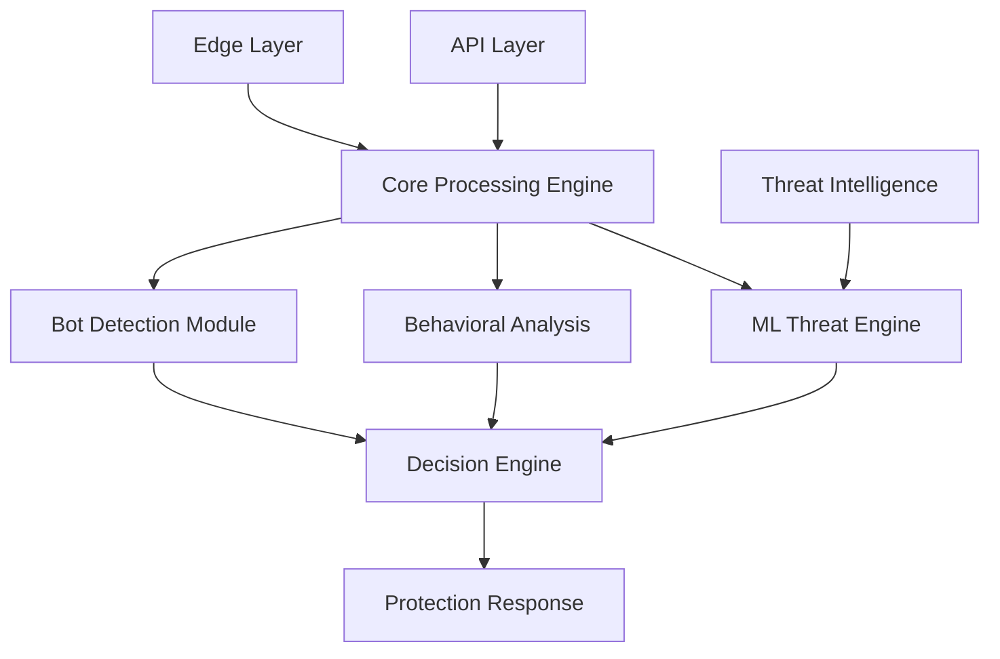

# Core 

IronShield Core serves as the **intelligence center** of your security infrastructure, providing advanced bot detection, behavioral analysis, and centralized threat coordination across all protection layers.

## Overview

The Core platform operates as the brain of IronShield's security ecosystem, analyzing patterns across multiple data sources to identify sophisticated threats that traditional rule-based systems miss. It employs machine learning algorithms and behavioral fingerprinting to distinguish between human users and automated attacks.

### Key Features

- **Advanced Bot Detection** - Multi-layered bot identification using behavioral analysis
- **Stateless Fingerprinting** - Device and browser fingerprinting without persistent storage
- **Machine Learning Engine** - Adaptive threat detection that improves over time
- **Behavioral Analysis** - Real-time user behavior profiling and anomaly detection
- **Threat Intelligence** - Integration with global threat feeds and reputation databases

## Architecture



## Getting Started

### Prerequisites

- **Minimum Requirements**: 8GB RAM, 4 CPU cores
- **Storage**: 50GB SSD for logs and ML models
- **Network Access**: Port 9090 for management, 9091 for inter-service communication
- **Database**: PostgreSQL 12+ or compatible

### Quick Deployment

```bash
# Deploy Core platform
docker run -d \
  --name ironshield-core \
  -p 9090:9090 -p 9091:9091 \
  -e CORE_DB_HOST=your-db-host \
  -e CORE_DB_USER=ironshield \
  -e CORE_DB_PASS=secure-password \
  -e CORE_API_KEY=your-api-key \
  -v /var/lib/ironshield/models:/app/models \
  ironshield/core:latest
```

## Configuration

### Basic Configuration

Create a `core-config.yml` file:

```yaml
core:
  # Database configuration
  database:
    host: localhost
    port: 5432
    database: ironshield_core
    user: ironshield
    password: secure-password
    
  # Bot detection settings
  bot_detection:
    enabled: true
    sensitivity: medium
    fingerprinting: true
    behavioral_analysis: true
    
  # Machine learning
  ml_engine:
    enabled: true
    model_update_interval: 24h
    training_data_retention: 30d
```

### Advanced Settings

#### Bot Detection Configuration

Fine-tune bot detection algorithms:

```yaml
bot_detection:
  fingerprinting:
    canvas_fingerprinting: true
    webgl_fingerprinting: true
    audio_fingerprinting: true
    screen_resolution: true
    timezone_detection: true
    
  behavioral_analysis:
    mouse_movement: true
    keystroke_dynamics: true
    scroll_patterns: true
    interaction_timing: true
    
  thresholds:
    bot_score_threshold: 0.7
    suspicious_score_threshold: 0.5
    challenge_score_threshold: 0.6
```

#### Machine Learning Settings

Configure the ML engine:

```yaml
ml_engine:
  models:
    - name: "bot_classifier"
      type: "random_forest"
      features: ["behavioral", "fingerprint", "network"]
      
    - name: "anomaly_detector"
      type: "isolation_forest"
      features: ["user_patterns", "request_sequences"]
      
  training:
    batch_size: 1000
    learning_rate: 0.001
    validation_split: 0.2
    epochs: 100
```

## Bot Detection

### Detection Methods

#### Fingerprinting Techniques

IronShield Core uses multiple fingerprinting methods:

```javascript
// Example fingerprinting data collected
{
  "browser": {
    "userAgent": "Mozilla/5.0...",
    "language": "en-US",
    "platform": "Win32",
    "plugins": ["Chrome PDF Plugin", "..."],
    "screen": {
      "width": 1920,
      "height": 1080,
      "colorDepth": 24
    }
  },
  "canvas": {
    "fingerprint": "a1b2c3d4e5f6...",
    "webgl": "g7h8i9j0k1l2..."
  },
  "timing": {
    "renderTime": 45,
    "loadTime": 1250
  }
}
```

#### Behavioral Analysis

Track user interaction patterns:

```yaml
behavioral_patterns:
  mouse_movements:
    - natural_acceleration: true
    - micro_movements: present
    - trajectory_smoothness: high
    
  keyboard_patterns:
    - typing_rhythm: human_like
    - key_hold_duration: variable
    - inter_key_timing: natural
    
  interaction_flow:
    - page_dwell_time: 15s
    - scroll_behavior: gradual
    - click_patterns: purposeful
```

### Custom Rules

Define custom bot detection rules:

```yaml
custom_rules:
  - name: "rapid_requests"
    condition: "request_rate > 10/second"
    action: "challenge"
    score_adjustment: +0.3
    
  - name: "headless_browser"
    condition: "webdriver_detected OR phantom_js_detected"
    action: "block"
    score_adjustment: +0.8
    
  - name: "suspicious_user_agent"
    condition: "user_agent MATCHES /bot|crawler|spider/i"
    action: "monitor"
    score_adjustment: +0.5
```

## Analytics & Monitoring

### Real-time Dashboard

Access the Core dashboard at `https://your-core-host:9090/dashboard`

Key metrics include:
- **Bot detection accuracy**
- **False positive/negative rates**
- **Threat classification breakdown**
- **ML model performance**
- **Processing latency**

### Performance Monitoring

```bash
# Monitor Core performance
docker exec ironshield-core core-stats

# View ML model metrics
curl -H "Authorization: Bearer $API_KEY" \
  https://your-core-host:9090/api/ml/model-stats

# Export detection logs
curl -H "Authorization: Bearer $API_KEY" \
  https://your-core-host:9090/api/logs/detections?format=json
```

### Machine Learning Insights

```bash
# View model training status
GET /api/v1/ml/training/status

# Get feature importance
GET /api/v1/ml/models/bot_classifier/features

# Model accuracy metrics
GET /api/v1/ml/models/accuracy?period=7d
```

## Integration

### Edge Platform Integration

Connect Core with Edge protection:

```yaml
edge_integration:
  endpoint: "https://edge.yourdomain.com:8080/api"
  api_key: "edge-api-key"
  sync_interval: 30s
  
  data_sharing:
    threat_scores: true
    fingerprints: true
    behavioral_data: false
```

### API Platform Integration

Configure API protection coordination:

```yaml
api_integration:
  endpoint: "https://api-gateway.yourdomain.com:7070/api"
  api_key: "api-gateway-key"
  
  protection_modes:
    - endpoint_specific_rules: true
    - rate_limit_coordination: true
    - threat_intelligence_sharing: true
```

## Troubleshooting

### Common Issues

#### High False Positive Rate

**Symptoms**: Legitimate users being flagged as bots
**Solution**: Adjust detection sensitivity

```yaml
bot_detection:
  sensitivity: low
  thresholds:
    bot_score_threshold: 0.8
    challenge_score_threshold: 0.7
```

#### ML Model Performance Issues

**Symptoms**: Degraded detection accuracy
**Solution**: Retrain models with recent data

```bash
# Trigger model retraining
curl -X POST -H "Authorization: Bearer $API_KEY" \
  https://your-core-host:9090/api/ml/retrain

# Check training progress
curl -H "Authorization: Bearer $API_KEY" \
  https://your-core-host:9090/api/ml/training/progress
```

#### Database Connection Issues

**Symptoms**: Core platform unable to store/retrieve data
**Solution**: Verify database configuration

```bash
# Test database connection
docker exec ironshield-core test-db-connection

# Check database logs
docker logs ironshield-core | grep -i database
```

## API Reference

### Core Management API

#### Get Detection Statistics

```http
GET /api/v1/stats/detection
Authorization: Bearer {api_key}

Response:
{
  "total_requests": 150000,
  "bot_detections": 15000,
  "false_positives": 150,
  "accuracy": 0.95
}
```

#### Update Bot Detection Rules

```http
PUT /api/v1/rules/bot-detection
Content-Type: application/json
Authorization: Bearer {api_key}

{
  "sensitivity": "high",
  "custom_rules": [
    {
      "name": "new_rule",
      "condition": "request_rate > 5/second",
      "action": "challenge"
    }
  ]
}
```

#### Machine Learning Model Management

```http
POST /api/v1/ml/models/{model_name}/train
Authorization: Bearer {api_key}

{
  "training_data_days": 7,
  "validation_split": 0.2
}
```

## Best Practices

### Performance Optimization

1. **Resource Allocation** - Ensure adequate CPU and memory for ML processing
2. **Database Tuning** - Optimize PostgreSQL for time-series data
3. **Model Management** - Regular model updates and performance monitoring
4. **Caching Strategy** - Implement fingerprint caching for faster lookups

### Security Recommendations

1. **API Security** - Use strong API keys and rotate regularly
2. **Database Security** - Encrypt sensitive behavioral data
3. **Network Security** - Secure inter-service communication
4. **Audit Logging** - Maintain comprehensive audit trails

### ML Model Management

1. **Regular Retraining** - Schedule periodic model updates
2. **Feature Engineering** - Continuously improve detection features
3. **A/B Testing** - Test new models against current production models
4. **Bias Monitoring** - Monitor for algorithmic bias in detection

## Support

Need help with Core platform deployment?

- 📖 [Core Documentation Hub](/docs/platforms/core)
- 💬 [ML Community Forum](https://ml.ironshield.cloud)
- 📧 [Core Platform Support](mailto:core-support@ironshield.cloud)
- 🤖 [AI/ML Technical Support](mailto:ml-support@ironshield.cloud)

## Next Steps

- [Configure Edge Platform](/docs/platforms/edge)
- [Set Up API Protection](/docs/platforms/api)
- [Self-Hosting Guide](/docs/self-hosting) 