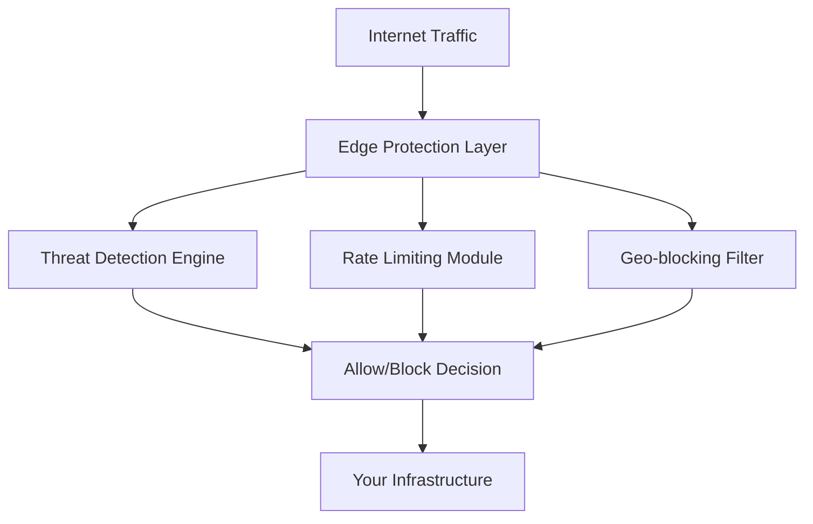

# Edge

IronShield Edge provides **edge-native protection** at the network perimeter, offering the first line of defense against sophisticated attacks before they reach your infrastructure.

## Overview

The Edge platform operates at the network edge, intercepting and analyzing traffic in real-time to identify and mitigate threats. It combines advanced pattern recognition with adaptive learning to stop attacks while maintaining optimal performance for legitimate users.

### Key Features

- **Real-time Traffic Analysis** - Deep packet inspection and behavioral analysis
- **Adaptive Proof of Work** - Dynamic challenge generation based on threat levels
- **Geo-blocking & Rate Limiting** - Intelligent traffic shaping and regional controls
- **SSL/TLS Termination** - Secure certificate management and encryption handling
- **CDN Integration** - Seamless integration with content delivery networks

## Architecture



## Getting Started

### Prerequisites

- **Minimum Requirements**: 4GB RAM, 2 CPU cores
- **Network Access**: Ports 80, 443, and management port 8080
- **SSL Certificates**: Valid certificates for your domain(s)

### Quick Deployment

```bash
# Deploy Edge protection
docker run -d \
  --name ironshield-edge \
  -p 80:80 -p 443:443 -p 8080:8080 \
  -e EDGE_DOMAIN=yourdomain.com \
  -e EDGE_API_KEY=your-api-key \
  -v /path/to/certs:/etc/ssl/certs \
  ironshield/edge:latest
```

## Configuration

### Basic Configuration

Create an `edge-config.yml` file:

```yaml
edge:
  # Domain configuration
  domains:
    - yourdomain.com
    - www.yourdomain.com
  
  # Protection settings
  protection:
    enabled: true
    challenge_mode: adaptive
    rate_limit: 1000/minute
    
  # Geo-blocking
  geo_blocking:
    enabled: true
    blocked_countries: ["CN", "RU"]
    whitelist_ips: []
```

### Advanced Settings

#### Adaptive Proof of Work

Configure dynamic challenge generation:

```yaml
proof_of_work:
  base_difficulty: 4
  max_difficulty: 12
  adaptive_scaling: true
  challenge_types:
    - computational
    - memory_hard
    - time_delay
```

#### Traffic Shaping

Set up intelligent rate limiting:

```yaml
rate_limiting:
  global_limit: 10000/minute
  per_ip_limit: 100/minute
  burst_allowance: 50
  sliding_window: 60s
```

## Monitoring & Analytics

### Real-time Dashboard

Access the Edge dashboard at `https://yourdomain.com:8080/dashboard`

Key metrics include:
- **Requests per second**
- **Threat detection rate**
- **Geographic traffic distribution**
- **Challenge success rates**

### Log Analysis

```bash
# View live traffic logs
docker logs -f ironshield-edge

# Export analytics data
curl -H "Authorization: Bearer $API_KEY" \
  https://yourdomain.com:8080/api/analytics/export
```

## Integration

### CDN Integration

IronShield Edge works seamlessly with popular CDNs:

- **Cloudflare** - Dual-layer protection
- **AWS CloudFront** - Origin shield configuration
- **Azure CDN** - Custom rule integration

### API Gateway Integration

```bash
# Configure API gateway upstream
upstream backend {
    server 127.0.0.1:3000;
    server 127.0.0.1:3001;
}

server {
    listen 443 ssl;
    server_name api.yourdomain.com;
    
    location / {
        proxy_pass http://backend;
        proxy_set_header X-IronShield-Protected "true";
    }
}
```

## Troubleshooting

### Common Issues

#### High False Positive Rate

**Symptoms**: Legitimate users receiving challenges
**Solution**: Adjust challenge sensitivity

```yaml
protection:
  challenge_mode: conservative
  whitelist_user_agents:
    - "GoogleBot"
    - "BingBot"
```

#### Performance Degradation

**Symptoms**: Increased response times
**Solution**: Optimize processing settings

```bash
# Check resource usage
docker stats ironshield-edge

# Adjust worker processes
echo "edge.workers=8" >> /etc/ironshield/edge.conf
```

#### SSL Certificate Issues

**Symptoms**: Certificate validation errors
**Solution**: Verify certificate configuration

```bash
# Check certificate validity
openssl x509 -in /etc/ssl/certs/domain.crt -text -noout

# Reload certificates
docker exec ironshield-edge reload-certs
```

## API Reference

### Edge Management API

#### Get Protection Status

```http
GET /api/v1/protection/status
Authorization: Bearer {api_key}
```

#### Update Rate Limits

```http
PUT /api/v1/rate-limits
Content-Type: application/json
Authorization: Bearer {api_key}

{
  "global_limit": 15000,
  "per_ip_limit": 150
}
```

#### Get Analytics Data

```http
GET /api/v1/analytics?period=24h&format=json
Authorization: Bearer {api_key}
```

## Best Practices

### Security Recommendations

1. **Regular Updates** - Keep Edge platform updated to latest version
2. **Certificate Rotation** - Automate SSL certificate renewal
3. **Monitoring Setup** - Configure alerting for anomalous traffic
4. **Backup Configuration** - Regularly backup protection rules

### Performance Optimization

1. **Resource Allocation** - Monitor CPU and memory usage
2. **Cache Configuration** - Optimize caching for static content
3. **Load Balancing** - Distribute traffic across multiple Edge nodes
4. **Geographic Distribution** - Deploy Edge nodes closer to users

## Support

Need help with Edge platform deployment?

- 📖 [Edge Documentation Hub](/docs/platforms/edge)
- 💬 [Community Forum](https://community.ironshield.cloud)
- 📧 [Enterprise Support](mailto:edge-support@ironshield.cloud)
- 🔧 [Technical Support Portal](https://support.ironshield.cloud)

## Next Steps

- [Configure Core Platform](/docs/platforms/core)
- [Set Up API Protection](/docs/platforms/api)
- [Self-Hosting Guide](/docs/self-hosting) 