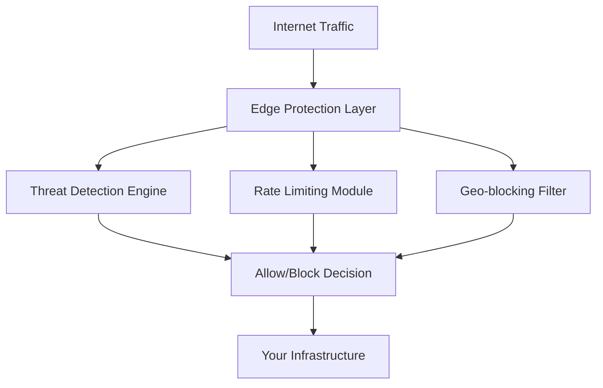

# Edge

IronShield Edge provides **edge-native** at the network perimeter, stopping sophisticated attacks **before** they reach your infrastructure and drive your cloud bills up.

## Overview

The Edge platform operates at the network edge, intercepting and analyzing traffic in real-time to identify and mitigate threats. It combines advanced pattern recognition with adaptive learning to stop attacks while maintaining optimal performance for legitimate users.

### Key Features

- **Real-time Traffic Analysis** - Deep packet inspection and behavioral analysis
- **Adaptive Proof of Work** - Dynamic challenge generation based on threat levels
- **Geo-blocking & Rate Limiting** - Intelligent traffic shaping and regional controls
- **SSL/TLS Termination** - Secure certificate management and encryption handling
- **CDN Integration** - Seamless integration with content delivery networks

## Architecture

